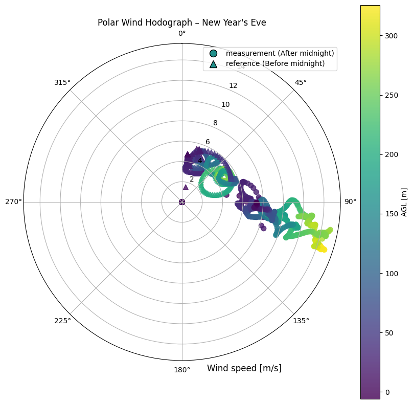
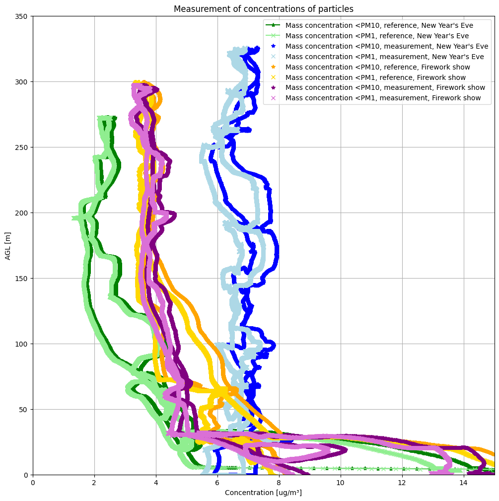
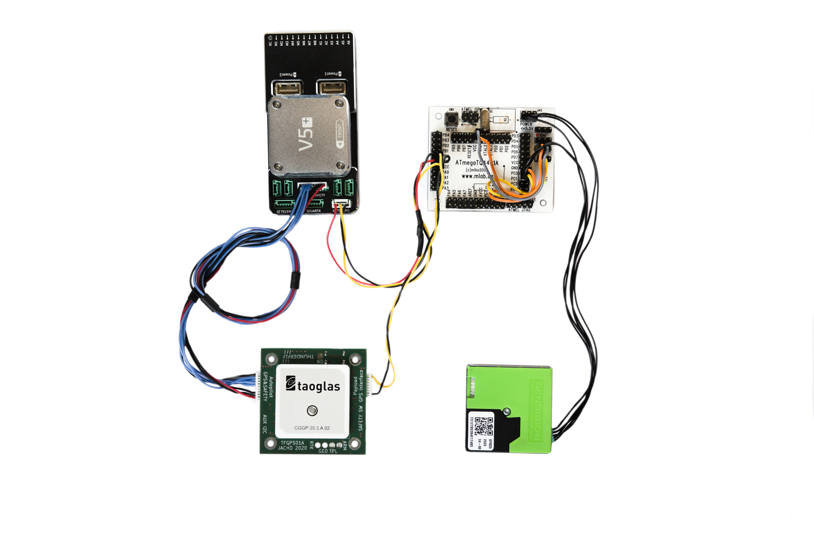

# TFPM01 - The first generation of TF-ATMON Particulate matter sensor

Particulate matter sensor for [TF-ATMON system](https://www.thunderfly.cz/tf-atmon.html) is based on [Sensirion SPS30](https://sensirion.com/products/catalog/SPS30/), [TFGPS01](https://github.com/ThunderFly-aerospace/TFGPS01) and [TFUNIPAYLOAD](https://github.com/ThunderFly-aerospace/TFUNIPAYLOAD01).

Look to the following video for a demonstration flight of a sensor mounted on [TF-G2 autogyro](https://github.com/ThunderFly-aerospace/TF-G2). 

The design of TFPM01 is obsolete because the particulate matter sensor is now read out directly by PX4 firmware and therefore is replaced by [TFPM02](https://github.com/ThunderFly-aerospace/TFPM02).

## Application Example: Airborne Measurement of Fireworks Pollution

A notable application of the TFPM01 sensor was its deployment in an airborne measurement campaign around New Year’s Eve. The goal was to assess the impact of fireworks on atmospheric aerosol concentrations.

Using a TF-ATMON-equipped TF-G2, the experiment demonstrated:

* **Very low particulate levels** during a reference flight before midnight (clean atmospheric conditions).
* **A sharp increase in PM concentrations** immediately after midnight, due to widespread amateur fireworks.
* **Sustained pollution levels** the following day, in contrast to the limited local impact of a professional fireworks display.

Such experiments highlight the potential of TFPM01 (and its successor TFPM02) for real-time atmospheric monitoring in vertical profiles.

Further analysis is available in this [Jupyter notebook](https://github.com/ThunderFly-aerospace/TF-ATMON/blob/TF-ATMON01A/notebooks/fireworks_dust.ipynb).

## The Connection diagram between SPS30 and TFUNIPAYLOAD

The sensor is connected to the [TFUNIPAYLOAD](https://github.com/ThunderFly-aerospace/TFUNIPAYLOAD01) by using [SZH-200BK26 wires](https://www.tme.eu/cz/details/szh-200bk26/signalove-konektory-raster-1-50mm/jst/) and [ZHR-5](https://www.tme.eu/cz/details/zhr-5/signalove-konektory-raster-1-50mm/jst/). For testing and development of TFUNIPAYLOAD firmware, the [ATmegaTQ4401A](https://www.mlab.cz/module/ATmegaTQ4401A/) module was used as shown in the diagram.
The ATmega runs the Arduino firmware, which prepares [MAVLink](https://en.wikipedia.org/wiki/MAVLink) messages ready to log and transport to TF-ATMON-enabled GCS. 

The block schematics of design are equivalent to the following photo

> Do not refer to the photo exactly for pinout. Instead, use the following table

| SPS30 Pin | Signal | MCU | Color |
| ---------------:|:-----:|:-------:|-------|
|   1             | VDD +5V - Supply voltage |  Vcc      | Red   |
|   2             | SDA |  D17 / SDA  + resistor 10k to Vcc   | Black |
|   3             | SCL   |  D16 / SCL + resistor 10k to Vcc     | Black |
|   4             | Interface select  Floating - UART, GND I2C.  |  GND     | Black |
|   5 (outer edge) | GND   |  GND      | Black |

GPS PPS signal is connected to pin 12 (PD4), this [could be changed in source code](https://github.com/ThunderFly-aerospace/TFPM01/blob/13cda4ffa5fd143e18c20526534e9ce3898b00ca/SW/arduino/SPS30MAV_small/SPS30MAV_small.ino#L33).
